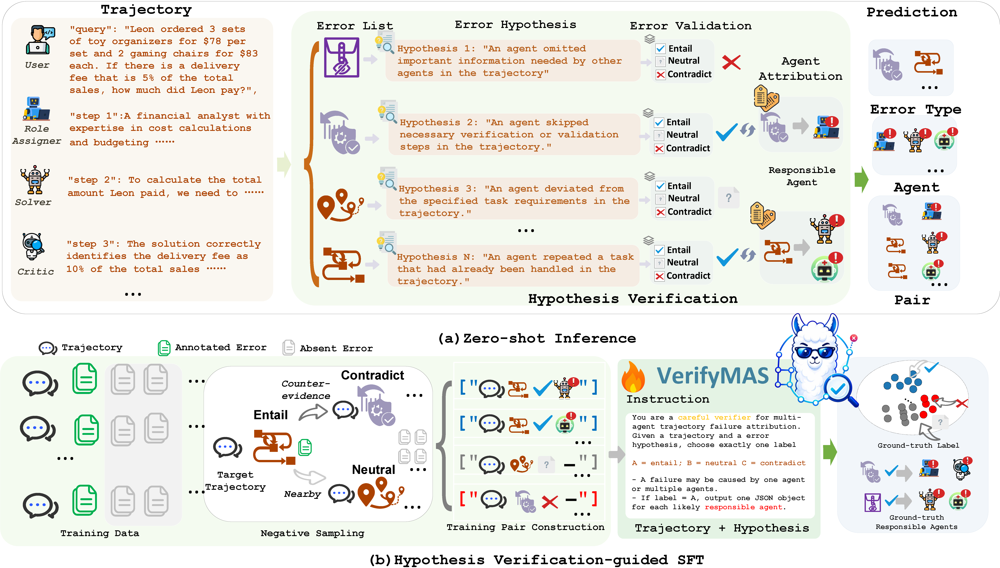
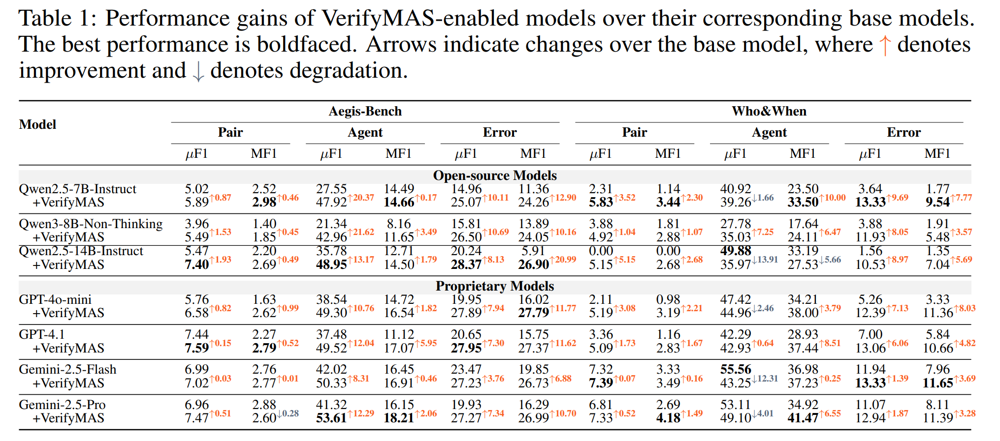

<div align="center">


## OVerifyMAS: Hypothesis Verification for Failure Attribution in LLM Multi-Agent Systems

[](https://arxiv.org/abs/2605.08715)
[](https://hezheqiao2022.github.io/VerifyMAS/)
[](https://huggingface.co/datasets/ZBox008003/AFTraj)
[](LICENSE)

</div>

---

## Overview

We propose **VerifyMAS**, a **hypothesis verification framework** for agent failure attribution. Instead of directly predicting faulty agents and error types, VerifyMAS formulates and verifies failure hypotheses against **full trajectories**. This verification-based approach decomposes attribution into trajectory-level error validation and fine-grained agent localization, providing an **error-first attribution approach** that captures global failure patterns while substantially reducing the search space. We further introduce a **hypothesis-based data construction strategy** grounded in a structured error taxonomy and fine-tune a specialized LLM verifier model for trajectory-level failure verification and agent attribution. Experiments on Aegis-Bench and Who&When show that VerifyMAS consistently improves diverse backbone models, including open-source Qwen and API-based GPT models, outperforming prior methods without sacrificing inference efficiency for long multi-agent trajectories.

<div align="center"></div>

## Key Highlights

- We propose **VerifyMAS**, an error-first hypothesis verification framework for failure attribution in LLM-MAS. It decomposes failure attribution into error validation and fine-grained faulty agent localization, providing a principled solution for agentic failure attribution of both global and local errors.  

- We propose a fine-tuning strategy tailored to the hypothesis verification approach, in which trajectory-level verification samples and agent-localization supervision are collected and leveraged to fine-tune an LLM verifier model under the VerifyMAS framework. This substantially enhances our model in failure diagnosis of in-distribution trajectories while preserving robust generalization to out-of-distribution trajectories. The dataset will be released to promote more advances in this line.  

- Extensive experiments on *Aegis-Bench* and *Who&When* demonstrate that VerifyMAS consistently improves diverse open-source and proprietary models. We further validate its effectiveness under the SFT setting, where hypothesis-verification-based fine-tuning strengthens in-distribution diagnostic ability while preserving out-of-distribution generalization.


## Main Results

<div align="center"></div>

## Repository Structure


## Citation

If you find this work useful, please cite:


```

## License

- **Code** (`inference/`): MIT License — see [LICENSE](LICENSE).
- **Dataset** (HuggingFace `ZBox008003/AFTraj`): CC BY 4.0.
