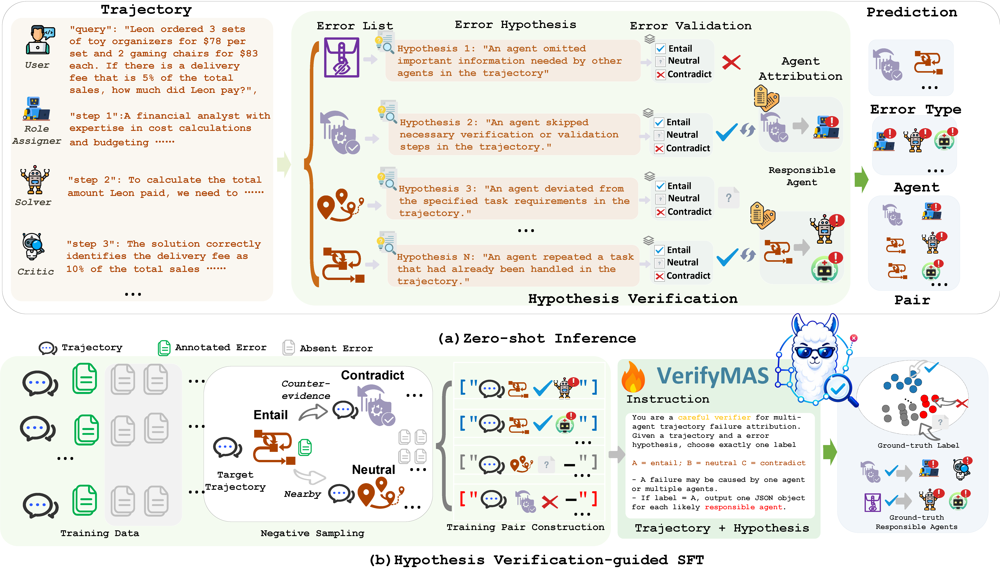
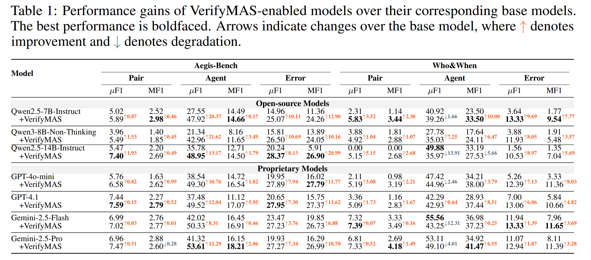

<div align="center">


## VerifyMAS: Hypothesis Verification for Failure Attribution in LLM Multi-Agent Systems

[](https://arxiv.org/abs/2605.17467)
[](https://hezheqiao2022.github.io/VerifyMAS/)
[]()
[](LICENSE)

</div>

---

## Overview

We propose **VerifyMAS**, a **hypothesis verification framework** for agent failure attribution. Instead of directly predicting faulty agents and error types, VerifyMAS formulates and verifies failure hypotheses against **full trajectories**. This verification-based approach decomposes attribution into trajectory-level error validation and fine-grained agent localization, providing an **error-first attribution approach** that captures global failure patterns while substantially reducing the search space. We further introduce a **hypothesis-based data construction strategy** grounded in a structured error taxonomy and fine-tune a specialized LLM verifier model for trajectory-level failure verification and agent attribution. Experiments on Aegis-Bench and Who&When show that VerifyMAS consistently improves diverse backbone models, including open-source Qwen and API-based GPT models, outperforming prior methods without sacrificing inference efficiency for long multi-agent trajectories.

<div align="center"></div>


## Main Results

<div align="center"></div>

## Repository Structure

The `main` branch is organized around data, SFT data preparation, baseline inference, and zero-shot evaluation. VerifyMAS verifies failure hypotheses against full multi-agent trajectories to identify errors and responsible agents.

| Directory or file | Contents and purpose |
|---|---|
| [`baselines/`](https://github.com/mala-lab/VerifyMAS/tree/main/baselines) | Baseline inference scripts, including CoT and error-first variants, plus `prompt.txt` and `prompt_cot.txt` |
| [`data/`](https://github.com/mala-lab/VerifyMAS/tree/main/data) | Two JSONL files of test datasets: `test_aegis.jsonl` and `whowhen.jsonl` |
| [`sft_data_construction/`](https://github.com/mala-lab/VerifyMAS/tree/main/sft_data_construction) | Scripts for converting multi-agent JSONL data, including one that handles rare agents |
| [`training_data/`](https://github.com/mala-lab/VerifyMAS/tree/main/training_data) |The training datasets and log for SFT |
| [`zero_shot/`](https://github.com/mala-lab/VerifyMAS/tree/main/zero_shot) | Inference and evaluation scripts for standard evaluation, SFT-model evaluation, and OpenAI API inference |

The processed training data for **VerifyMAS** can be downloaded from [this Google Drive folder](https://drive.google.com/drive/folders/1iY-BNHaz4GrvhPUf-nMscxlLMIw5nIeG?usp=sharing).

## 📖 Citation
    
If you find this work useful, please cite our paper:

```bibtex
@article{qiao2026verifymas,
  title={VerifyMAS: Hypothesis Verification for Failure Attribution in LLM Multi-Agent Systems},
  author={Qiao, Hezhe and Tong, Hanghang and Lim, Ee-Peng and Liu, Bing and Pang, Guansong},
  journal={arXiv preprint arXiv:2605.17467},
  year={2026}
}

